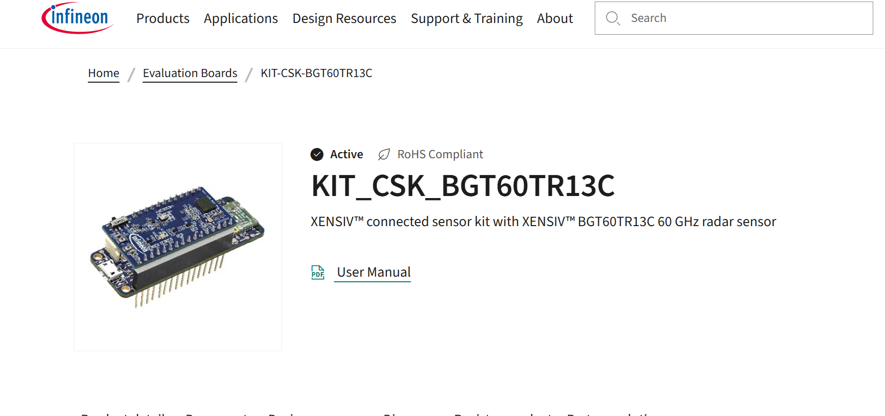

# KIT-CSK-BGT60TR13C   

 

* KIT-CSK-BGT60TR13C   
    https://www.infineon.com/evaluation-board/KIT-CSK-BGT60TR13C

 
 

## ModusToolbox Tools Pack

 

* Window Version 
    [modustoolbox_3.6.0.17979_Windows_x64.exe](https://softwaretools.infineon.com/tools/com.ifx.tb.tool.modustoolbox?_gl=1*qg2ibq*_gcl_au*MTM2NDEyNjgyMi4xNzY1ODcxNTIy*_ga*MTYxMDQ2ODcxMi4xNzY1ODcxNTIy*_ga_KVD0BL538B*czE3NjU4NzE1MjIkbzEkZzEkdDE3NjU4NzE1MzUkajQ3JGwwJGgxMDQwNzkwODcw) 

* 

 

* 

https://www.infineon.com/assets/row/public/documents/30/44/infineon-modustoolbox-eclipse-ide-user-guide-usermanual-en.pdf

https://www.infineon.com/assets/row/public/documents/30/44/infineon-visual-studio-code-user-guide-usermanual-en.pdf

 

## User Guide for XENSIV™ KIT CSK BGT60TR13C

* User Guide for XENSIV™ KIT CSK BGT60TR13C   
https://www.infineon.com/assets/row/public/documents/24/44/infineon-ug105330-kit-csk-bgt60tr13c-xensiv-connected-sensor-kit-usermanual-en.pdf  

